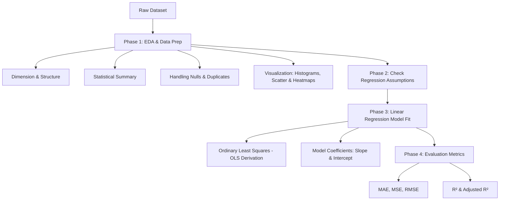

# 📝 Ultimate Topper's Notes: Exploratory Data Analysis (EDA) & Linear Regression

---

## 🌟 Quick Index & Concept Map


---

## 🔍 Phase 1: Step-by-Step Exploratory Data Analysis (EDA)

Exploratory Data Analysis is the **detective work** of Data Science. Before training any machine learning model, we must understand the structure of the data, detect anomalies, identify patterns, and check relationships.

### Step 1: Structure & Dimension Inspection
We load the dataset using `pandas` and inspect its shape, column types, and general structure.

```python
import pandas as pd
import numpy as np

# Load dataset (e.g., student_scores.csv)
df = pd.read_csv('student_scores.csv')

# 1. Check dimensions (Rows, Columns)
print("Shape of Dataset:", df.shape) # Output: (25, 2)

# 2. Inspect data types and non-null counts
df.info()
```

> [!TIP]
> **Topper's Tip:** Always check data types first. Sometimes numbers are stored as strings (object type) due to corrupted characters (e.g., `"?"` or `"N/A"`), which prevents mathematical calculations. Use `df.dtypes` to verify.

---

### Step 2: Statistical Summarization
Generate summary statistics to get a sense of scales, distributions, and central tendencies.

```python
# Statistical summary of numerical columns
df.describe()
```
* **Mean vs. Median (50%):** If the Mean is significantly larger than the Median, the distribution is **right-skewed** (outliers on the high end). If the Median is larger, it is **left-skewed**.
* **Min/Max:** Inspect these to find anomalies (e.g., negative values for age or salary, scores greater than 100).

---

### Step 3: Data Cleaning & Quality Checks
Before plotting or modeling, clean the dataset to prevent skewed outcomes.

```python
# 1. Check for Missing (Null) Values
print(df.isnull().sum())

# 2. Check for Duplicate Rows
print("Duplicates found:", df.duplicated().sum())

# 3. Drop duplicates if any
df = df.drop_duplicates()
```
* **Handling Nulls:** If nulls exist, we either drop them (`df.dropna()`) if they are few, or impute them (using mean/median for numerical variables, or mode for categorical variables).

---

### Step 4: Univariate Analysis (Individual Variable Distributions)
Univariate analysis looks at one variable at a time to examine its distribution, spread, skewness, and outliers.

#### 📊 Visualizations:
1. **Histograms:** To visualize the frequency distribution.
2. **Box Plots:** To identify outliers (values outside $1.5 \times \text{IQR}$).

```python
import matplotlib.pyplot as plt
import seaborn as sns

# Plot distribution of X (e.g., Hours Studied)
plt.figure(figsize=(10, 4))
plt.subplot(1, 2, 1)
sns.histplot(df['Hours'], kde=True, color='royalblue')
plt.title('Distribution of Hours Studied')

# Plot Boxplot to detect outliers in Y (e.g., Scores)
plt.subplot(1, 2, 2)
sns.boxplot(y=df['Scores'], color='salmon')
plt.title('Outliers in Scores')
plt.show()
```

---

### Step 5: Bivariate Analysis (Relationship Between Two Variables)
Since Linear Regression models the relationship between an independent variable ($X$) and a dependent variable ($Y$), this step is critical.

#### 📈 Visualizations & Calculations:
1. **Scatter Plot:** To visually inspect if the trend is linear, non-linear, or random.
2. **Correlation Coefficient ($r$):** Quantifies the strength and direction of the linear relationship (ranges from $-1$ to $+1$).

```python
# 1. Scatter Plot
plt.figure(figsize=(6, 4))
sns.scatterplot(x='Hours', y='Scores', data=df, color='darkviolet')
plt.title('Hours Studied vs. Percentage Score')
plt.xlabel('Hours Studied')
plt.ylabel('Percentage Score')
plt.show()

# 2. Correlation Matrix Heatmap
sns.heatmap(df.corr(), annot=True, cmap='coolwarm', fmt=".2f")
plt.title('Correlation Matrix Heatmap')
plt.show()
```

---

## 📈 Phase 2: Linear Regression — Concept & Mathematical Deep Dive

### 1. What is Linear Regression?
Linear Regression is a supervised learning algorithm used to predict a continuous quantitative dependent variable $Y$ based on one or more independent variables $X$.
* **Simple Linear Regression (SLR):** Only 1 independent variable ($X$).
* **Multiple Linear Regression (MLR):** $\ge 2$ independent variables ($X_1, X_2, \dots, X_p$).

### 2. The Mathematical Model (Simple Linear Regression)
$$Y = \beta_0 + \beta_1 X + \epsilon$$

Where:
* $Y$ = Dependent variable (Target, e.g., `Scores` or `Salary`)
* $X$ = Independent variable (Feature, e.g., `Hours` or `YearsExperience`)
* $\beta_0$ = Intercept (where the regression line crosses the y-axis, i.e., value of $Y$ when $X = 0$)
* $\beta_1$ = Slope (change in $Y$ for every unit change in $X$)
* $\epsilon$ = Error term / Residual (deviation of actual points from the fitted line)

### 3. The Predicted Line
$$\hat{Y} = \beta_0 + \beta_1 X$$
Where $\hat{Y}$ (pronounced "Y-hat") is the predicted value.

---

### 🧮 4. Step-by-Step OLS (Ordinary Least Squares) Derivation
The objective of Linear Regression is to find the best line (the values of $\beta_0$ and $\beta_1$) that minimizes the sum of squared errors between the actual data points and the predicted line.

#### Step A: Define the Cost Function (Residual Sum of Squares - RSS)
$$RSS = \sum_{i=1}^n e_i^2 = \sum_{i=1}^n (y_i - \hat{y}_i)^2$$
Substitute $\hat{y}_i = \beta_0 + \beta_1 x_i$:
$$RSS(\beta_0, \beta_1) = \sum_{i=1}^n (y_i - (\beta_0 + \beta_1 x_i))^2$$

#### Step B: Find $\beta_0$ (Intercept) by taking the Partial Derivative
To minimize RSS, take the partial derivative with respect to $\beta_0$ and set it to $0$:
$$\frac{\partial RSS}{\partial \beta_0} = \frac{\partial}{\partial \beta_0} \sum_{i=1}^n (y_i - \beta_0 - \beta_1 x_i)^2 = 0$$

Using the chain rule:
$$-2 \sum_{i=1}^n (y_i - \beta_0 - \beta_1 x_i) = 0$$
$$\sum_{i=1}^n y_i - \sum_{i=1}^n \beta_0 - \beta_1 \sum_{i=1}^n x_i = 0$$

Since $\sum_{i=1}^n \beta_0 = n \beta_0$:
$$\sum_{i=1}^n y_i - n \beta_0 - \beta_1 \sum_{i=1}^n x_i = 0$$

Divide the entire equation by $n$:
$$\frac{1}{n}\sum_{i=1}^n y_i - \beta_0 - \beta_1 \left(\frac{1}{n}\sum_{i=1}^n x_i\right) = 0$$
$$\bar{y} - \beta_0 - \beta_1 \bar{x} = 0$$

$$\mathbf{\beta_0 = \bar{y} - \beta_1 \bar{x}}$$

> [!IMPORTANT]
> **Key Intuition:** The regression line *always* passes through the mean point of the dataset $(\bar{x}, \bar{y})$.

---

#### Step C: Find $\beta_1$ (Slope) by taking the Partial Derivative
Now take the partial derivative of RSS with respect to $\beta_1$ and set it to $0$:
$$\frac{\partial RSS}{\partial \beta_1} = \frac{\partial}{\partial \beta_1} \sum_{i=1}^n (y_i - \beta_0 - \beta_1 x_i)^2 = 0$$

Using the chain rule:
$$-2 \sum_{i=1}^n x_i (y_i - \beta_0 - \beta_1 x_i) = 0$$
$$\sum_{i=1}^n x_i (y_i - \beta_0 - \beta_1 x_i) = 0$$

Substitute $\beta_0 = \bar{y} - \beta_1 \bar{x}$ into the equation:
$$\sum_{i=1}^n x_i \left(y_i - (\bar{y} - \beta_1 \bar{x}) - \beta_1 x_i\right) = 0$$
$$\sum_{i=1}^n x_i \left( (y_i - \bar{y}) - \beta_1 (x_i - \bar{x}) \right) = 0$$
$$\sum_{i=1}^n x_i (y_i - \bar{y}) - \beta_1 \sum_{i=1}^n x_i (x_i - \bar{x}) = 0$$

Using standard algebraic properties of deviations from the mean ($\sum (x_i - \bar{x}) = 0$):
$$\sum_{i=1}^n (x_i - \bar{x})(y_i - \bar{y}) - \beta_1 \sum_{i=1}^n (x_i - \bar{x})^2 = 0$$

Solving for $\beta_1$:
$$\mathbf{\beta_1 = \frac{\sum_{i=1}^n (x_i - \bar{x})(y_i - \bar{y})}{\sum_{i=1}^n (x_i - \bar{x})^2} = \frac{\text{Cov}(X, Y)}{\text{Var}(X)}}$$

This is the OLS closed-form equation for the slope!

---

### 🎨 Visualizing Residuals
The vertical distance between the actual point and the regression line represents the residual ($e_i$):

```text
       Y ^             • (x_i, y_i) Actual Point
         |            /|
         |           / | e_i = y_i - y_hat_i (Residual/Error)
         |          /  |
         |         /   o (x_i, y_hat_i) Predicted Point on Line
         |        /   /
         |       /   /  y_hat = beta_0 + beta_1 * X
         |      /   /
         +-------------------------------------> X
```

---

## 📋 Phase 3: The 5 Core Assumptions of Linear Regression

For a linear regression model to yield reliable and unbiased estimators, five conditions must be met:

| Assumption | What it means | Diagnostic Tool | How to fix if violated |
| :--- | :--- | :--- | :--- |
| **1. Linearity** | The relationship between independent and dependent variables must be linear. | Scatter plot of $X$ vs $Y$, Residual Plot | Apply non-linear transformations (log, square root, polynomial features). |
| **2. Independence of Errors** | Residuals of data points must not be correlated with each other (no autocorrelation). | Durbin-Watson statistic ($DW \approx 2.0$) | Use time-series analysis (e.g., Autoregressive models) if autocorrelation is found. |
| **3. Homoscedasticity** | The variance of residuals must remain constant across all levels of independent variables. | Residuals vs. Fitted plot (should show a random cloud, not a funnel shape) | Log-transform the target variable $Y$, or use Weighted Least Squares (WLS). |
| **4. Normality of Residuals** | The error terms must follow a normal distribution centered at $0$. | Q-Q Plot (points should lie on the straight line), Shapiro-Wilk test | Transform skewed variables (e.g., Log/Box-Cox transform). |
| **5. No Multicollinearity** | Independent variables must not be highly correlated with each other (only applies to Multiple Regression). | Variance Inflation Factor (VIF > 5 or 10 indicates high multicollinearity) | Drop one of the highly correlated features, or combine them using PCA. |

---

## 📊 Phase 4: Model Evaluation Metrics

Once we fit a model, how do we know if it is good? We calculate error metrics:

### 1. Mean Absolute Error (MAE)
Average of absolute differences between actual values and predictions.
$$MAE = \frac{1}{n}\sum_{i=1}^n |y_i - \hat{y}_i|$$
* **Intuition:** Robust to outliers since errors are not squared.
* **Unit:** Same as target variable.

### 2. Mean Squared Error (MSE)
Average of squared differences between actual values and predictions.
$$MSE = \frac{1}{n}\sum_{i=1}^n (y_i - \hat{y}_i)^2$$
* **Intuition:** Penalizes larger errors heavily (a single large error increases MSE drastically).
* **Unit:** Squared unit of target (harder to interpret directly).

### 3. Root Mean Squared Error (RMSE)
Square root of MSE.
$$RMSE = \sqrt{\frac{1}{n}\sum_{i=1}^n (y_i - \hat{y}_i)^2}$$
* **Intuition:** Brings the metric unit back to the original scale of the target variable. Highly popular for gradient-based optimizations.

### 4. Coefficient of Determination ($R^2$ Score)
Measures the proportion of variance in the dependent variable explained by the independent variable(s).
$$R^2 = 1 - \frac{SS_{residual}}{SS_{total}} = 1 - \frac{\sum (y_i - \hat{y}_i)^2}{\sum (y_i - \bar{y})^2}$$
* **Interpretation:** 
  * $R^2 = 1$: Perfect model.
  * $R^2 = 0$: Model performs no better than predicting the mean ($\bar{y}$).
  * $R^2 < 0$: Model is worse than predicting the mean.

---

## 💻 Phase 5: Complete End-to-End Implementation

Here is the clean, robust Python code block to perform EDA, train a Linear Regression model, evaluate its performance, and plot the regression line.

```python
# Import all required libraries
import numpy as np
import pandas as pd
import matplotlib.pyplot as plt
import seaborn as sns
from sklearn.model_selection import train_test_split
from sklearn.linear_model import LinearRegression
from sklearn.metrics import mean_absolute_error, mean_squared_error, r2_score

# ----------------- STEP 1: Load Data -----------------
# Reading student scores dataset (Hours vs Scores)
df = pd.read_csv('student_scores.csv')

# Quick check of values
print("--- FIRST 5 ROWS ---")
print(df.head())

# ----------------- STEP 2: Basic EDA -----------------
print("\n--- DATA SHAPE & DESCRIPTION ---")
print("Dimensions:", df.shape)
print("Null values count:")
print(df.isnull().sum())

# Check for duplicates
print(f"Duplicate rows: {df.duplicated().sum()}")

# Calculate Correlation
correlation = df.corr().iloc[0, 1]
print(f"Correlation coefficient between X and Y: {correlation:.4f}")

# ----------------- STEP 3: Feature Engineering / Preparation -----------------
# Reshape features to 2D arrays as required by scikit-learn
X = df[['Hours']].values  # Independent variable
y = df['Scores'].values   # Dependent variable

# Train-Test Split (80% Train, 20% Test)
X_train, X_test, y_train, y_test = train_test_split(X, y, test_size=0.2, random_state=42)
print(f"\nTraining set size: {X_train.shape[0]}, Test set size: {X_test.shape[0]}")

# ----------------- STEP 4: Model Training -----------------
model = LinearRegression()
model.fit(X_train, y_train)

# Coefficients
beta_1 = model.coef_[0]
beta_0 = model.intercept_
print("\n--- MODEL COEFFICIENTS ---")
print(f"Slope (beta_1): {beta_1:.4f}")
print(f"Intercept (beta_0): {beta_0:.4f}")
print(f"Fitted Equation: Score = {beta_0:.2f} + {beta_1:.2f} * Hours")

# ----------------- STEP 5: Predictions & Evaluation -----------------
y_pred = model.predict(X_test)

mae = mean_absolute_error(y_test, y_pred)
mse = mean_squared_error(y_test, y_pred)
rmse = np.sqrt(mse)
r2 = r2_score(y_test, y_pred)

print("\n--- EVALUATION METRICS ---")
print(f"Mean Absolute Error (MAE)  : {mae:.4f}")
print(f"Mean Squared Error (MSE)    : {mse:.4f}")
print(f"Root Mean Squared Error(RMSE): {rmse:.4f}")
print(f"R-squared (R2) Score        : {r2:.4f}")

# ----------------- STEP 6: Visualization -----------------
plt.figure(figsize=(8, 5))

# Plot training points (blue) and testing points (green)
plt.scatter(X_train, y_train, color='royalblue', label='Training Data', alpha=0.7)
plt.scatter(X_test, y_test, color='forestgreen', label='Test Data', marker='D', s=60)

# Plot the predicted regression line
line_range = np.linspace(X.min(), X.max(), 100).reshape(-1, 1)
plt.plot(line_range, model.predict(line_range), color='crimson', linewidth=2.5, label='Regression Line')

plt.title('Hours Studied vs Student Scores (Regression Line Fit)', fontsize=14)
plt.xlabel('Hours Studied', fontsize=12)
plt.ylabel('Percentage Score', fontsize=12)
plt.legend(loc='upper left')
plt.grid(True, linestyle='--', alpha=0.5)
plt.show()
```

---
